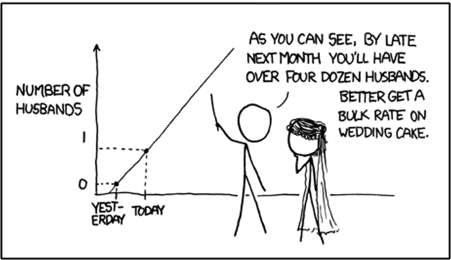

## Agenda

1. Fragestellungen für die Datenanalyse
2. Architektur des Data Warehouse
3. Auswertung der Cubes
4. Auswertung der Analyseergebnisse

## Fragestellungen für die Datenanalyse

### Kunden

- Was sind die kaufkräftigsten Kundengruppen?
- Was sind die aktivsten Kundengruppen?
- Wie viel Umsatz generieren die einzelnen Altersgruppen?

 

### Produkte

- Was sind die am häufigsten gekauften Produkte?
- Wie ist die Umsatzentwicklung bzw. –verteilung?
- Welche Produkte werden besonders häufig reklamiert und warum?

 

### Warenkorbanalyse

- Welche Produkte bzw. Produktgruppen werden besonders häufig zusammengekauft?
- Wie ist die zeitliche Entwicklung bestimmter Produktkombinationen?

## Architektur des Data Warehouse

### Cube Bestellungen

Note:

Untersuchung nach fünf Dimensionen

### Cube Retouren

Notes:

ähnlich Bestellungen

### Cube Cross-Selling

Note:

Cross-Selling auf Basis von Bestellungen

<!-- .slide: data-background="images/cube-bestellungen-sql.png" -->

## Auswertung des Cubes Bestellungen

### Umsatzentwicklung

Note:

keine Trend oder starke Monate erkennbar

Umastz korreliert mit Anzahl der Bestellungen

### Meistverkaufte Produkte

Note:

hauptsächlich Sommerbekleidung

keine großen Abstände

### Umsatzstärkste Produkte

Note:

keine spezielle Produktgruppe

Product M5 hat großen Abstand

Umastz und Anzahl der Bestellungen korrelieren nicht

### Umsatzstärkste Kundengruppe

Note:

40-50 w mit Newsletter mit Abstand

Frauen machen mehr Umsatz als Männer (sind auch echt mehr)

Umastz korreliert mit Anzahl der Bestellungen

<!-- .slide: data-background="images/cube-retouren-sql.png" -->

## Auswertung des Cubes Retouren

### Meistretournierte Produkte

Note:

hauptsächlich Bikinis

keine großen Abstände

### Retourenstärkste Kundengruppe

Note:

40-50 w (kaufen auch am meisten

korreliert generell mit Bestellungen

### Häufigster Retourengrund

Note:

DONTLIKE, TOBIG, TOSHORT, OTHER an der Spitze

<!-- .slide: data-background="images/cube-cross-sells-sql.png" -->

## Auswertung des Cubes Cross-Selling

### Cross-Selling zwischen Produkten

Note:

ähnliche Proukte werden zusammengekauft

hauptsächlich Sommersachen

### Zeitliche Entwicklung des Top-Cross-Sellings

### Cross-Selling zwischen Produktgruppen

Note:

häufig aus der selben Produktgruppe mehrere Produkte zusammengekauft

<!-- .slide: data-background="images/xkcd.png" -->

## Auswertung der Analyseergebnisse

### Analyseergebnisse

- Daten für Umsatzentwicklung ohne Auffälligkeiten
- Kunden kaufen vermehrt Sommerkleidung
- Frauen zwischen 40 und 60 sind umsatzstärkste Kundengruppe
- Retouren korrelieren mit Verkaufszahlen
- Männer geben weniger zurück als Frauen
- Retourengründe meist DONTLIKE, TOBIG, TOSHORT
- Generell fehlen Langzeitdaten für weitere Aussagen

### Empfehlungen

- Daten für Umsatzentwicklung nicht ausreichend für Empfehlungen
- Saisonangebote
- Ausrichtung auf Zielgruppe
- Keine Retourentreiber, die aus dem Sortiment genommen werden sollten
- Bessere Beschreibung von Produkt und Größe
- Artikel aus der gleichen Produktgruppe vorschlagen
- Anzeige von Cross-Selling-Vorschlägen
- Angebote zu Produktgruppen

## Fragen?

