## Agenda

1. Fragestellungen für die Datenanaylse
2. Architektur des Data Warehouse
3. Auswertung der Cubes
4. Bewertung der Analyseergebnisse

## Fragestellungen für die Datenanaylse

### Kunden

- Wer sind die kaufkräftigsten Kundengruppen?
- Wer sind die aktivsten Kundengruppen?
- Wie viel Umsatz generieren die einzelnen Altersgruppen?

### Produkte

- Was sind die meistverkauftesten Produkte? 
- Wie ist die Umsatzentwicklung bzw. –verteilung?
- Welche Produkte werden besonders häufig reklamiert und warum?

### Warenkorbanalyse

- Welche Produkte bzw. Produktgruppen werden besonders häufig zusammengekauft?
- Wie ist die zeitliche Entwicklung bestimmter Produktkombinationen?

## Architektur des Data Warehouse

### Cube Bestellungen

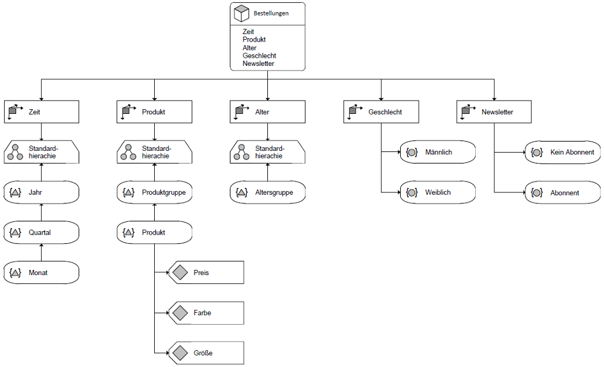

### Cube Retouren

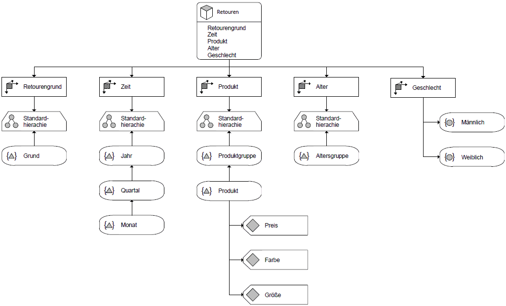

### Cube Cross-Sells

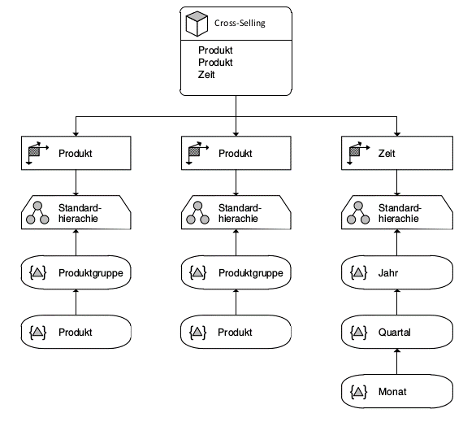

Note:

Cross-Selling auf Basis von Bestellungen

<!-- .slide: data-background="images/cube-bestellungen-sql.png" -->

## Auswertung des Cubes Bestellungen

### Umsatzentwicklung

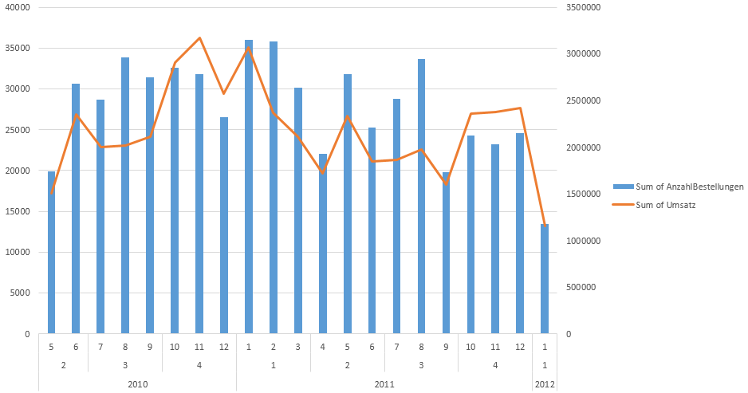

### Meistverkaufte Produkte

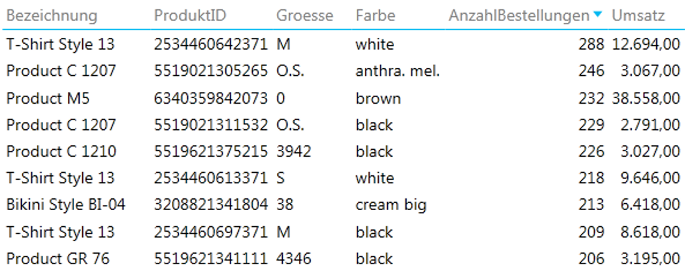

### Umsatzstärkste Produkte

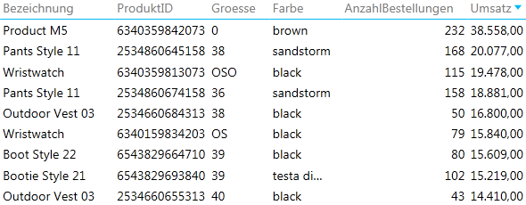

### Umsatzstärkste Kundengruppe

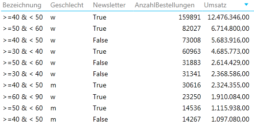

<!-- .slide: data-background="images/cube-retouren-sql.png" -->

## Auswertung des Cubes Retouren

### Meistretournierte Produkte

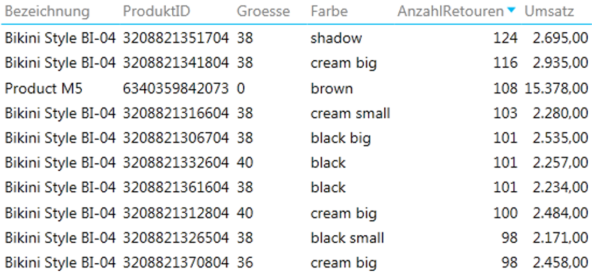

### Retourenstärkste Kundengruppe

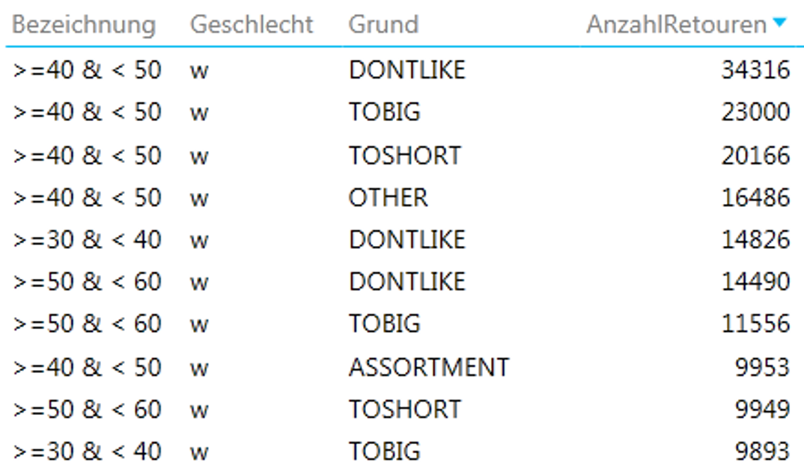

### Häufigster Retourengrund

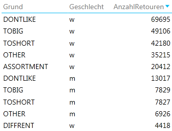

<!-- .slide: data-background="images/cube-cross-sells-sql.png" -->

## Auswertung des Cubes Cross-Sells

### Cross-Sellinge zwischen Produkten

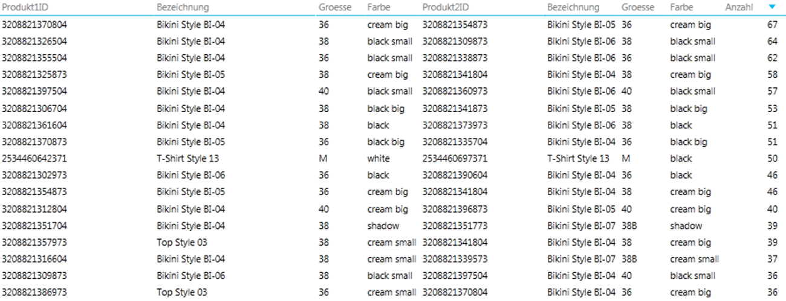

### Zeitliche Entwicklung des Top-Cross-Sells

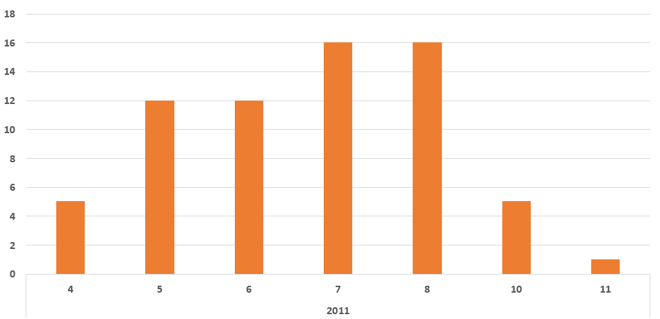

### Cross-Sellinge zwischen Produktgruppen

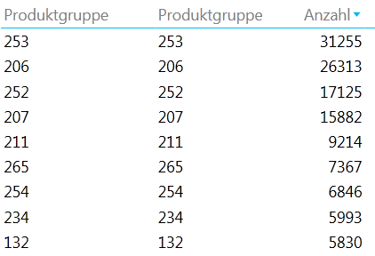

<!-- .slide: data-background="images/xkcd.png" -->

## Auswertung der Analyseergebnisse

### Auswertung der Analyseergebnisse

- Daten für Umsatzentwicklung nicht ausreichen für Empfehlungen
- Kunden kaufen vermehrt Sommerkleidung
	- Spezielle Saisonangebote
- Frauen zwischen 40 und 60 sind die umsatzstärkste Kundengruppe
	- Spezielle Angebote/Ausrichtung
- Retourem entsprechend der Verkaufszahlen
	- Keine Ausreißer, die aus dem Sortiment genommen werden sollten
	- Männer geben weniger zurück als Frauen
- Retourengründe DONTLIKE, TOBIG, TOSHORT
	- Bessere Beschreibung von Produkt und Größe
- Empfehlungen für Produkte
	- Anzeige von Cross-Sellvorschlägen
	- Artikel aus der gleichen Produktgruppe vorschlagen
- Angebote zu Produktgruppen
- Generell fehlen Langzeitdaten für weitere Aussagen
